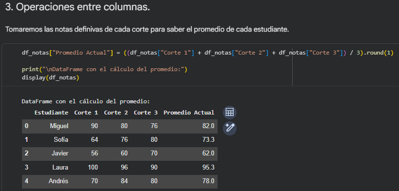
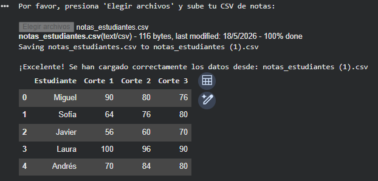

# Investigación y Práctica con Pandas.

  

## Descripción de la Actividad
Esta actividad corresponde al Corte 2 y consiste en realizar una investigación completa sobre la librería de Python **Pandas**, acompañada de ejercicios prácticos implementados en un Jupyter Notebook (Google Colab).

## Objetivo
Comprender los conceptos fundamentales de la librería Pandas, su propósito y su importancia crítica en el campo de la Inteligencia Artificial y el Análisis de Datos, además de adquirir experiencia práctica en la manipulación de DataFrames, lectura de archivos CSV y generación de datos sintéticos.

## Temas Investigados
El notebook de la actividad incluye la investigación detallada sobre los siguientes aspectos:
1. **¿Qué es Pandas?**: Librería de código abierto para estructuras de datos de alto rendimiento.
2. **¿Para qué sirve?**: Limpieza, manipulación y análisis de datos.
3. **Objetivo principal**: Ser la herramienta más potente y flexible para manipulación de datos open-source.
4. **Principales funciones**: Manejo de Series y DataFrames, alineación inteligente de datos, tratamiento de nulos, entre otras.
5. **Importancia en la IA**: Su rol vital en el preprocesamiento de datos (*Data Wrangling*) antes de entrenar modelos de Machine Learning.

## Explicación de los Ejercicios Realizados

En la segunda parte del notebook se desarrollaron los siguientes ejercicios prácticos (guiados por la estructura de 7 pasos):

### 1. Importar Pandas
Se importan las librerías necesarias (`pandas` y `numpy`) para el procesamiento de los datos.

### 2. Crear un DataFrame
Se construye manualmente un DataFrame desde cero a partir de un diccionario estructurado que contiene las notas de 5 estudiantes de IA en sus tres cortes.

### 3. Operaciones entre columnas
Se utiliza la vectorización de Pandas para crear una nueva columna ("Promedio Actual"), calculada promediando matemáticamente las notas de los cortes 1, 2 y 3.

### 4. Leer archivos CSV
Se utiliza la librería interactiva `google.colab.files` para abrir un selector de archivos que permite subir un documento CSV "de verdad" desde la computadora local (por ejemplo, el archivo `notas_estudiantes.csv`) y cargarlo directamente en un DataFrame en memoria.

### 5. Trabajar con datos sintéticos
Con la ayuda de la librería `numpy`, se generan variables aleatorias (notas y asistencias) para simular un dataset sintético de 10 estudiantes, el cual se carga en un nuevo DataFrame.

### 6. Estadísticas básicas
Se ejecuta el comando `.describe()` para obtener automáticamente un resumen estadístico (media, valores máximos y mínimos, etc.) de los datos de la clase.

### 7. Filtrar datos
Se aplica una condición directa sobre el DataFrame para filtrar y mostrar en pantalla únicamente a aquellos estudiantes que aprobaron la materia (nota >= 60).

## Capturas y Resultados Obtenidos

El código muestra con éxito la tabla original de estudiantes, el cálculo de los promedios, la correcta lectura del archivo CSV y las estadísticas descriptivas sobre el volumen de datos sintéticos generados.

### 1. Creación del DataFrame

### 2. Operaciones entre columnas

### 3. Leer archivo CSV

## Conclusiones
* Pandas es una herramienta excepcionalmente eficiente y potente para el manejo de estructuras tabulares.
* Evita el uso de bucles pesados al permitir operaciones directas y vectorizadas sobre columnas enteras de datos.
* Entender cómo manipular y transformar información con Pandas es un paso indispensable antes de implementar cualquier algoritmo de Inteligencia Artificial.
